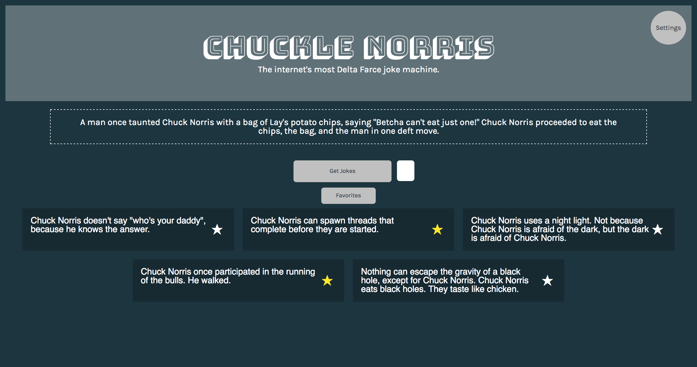

## Chuckle Norris
### A web application that displays random Chuck Norris jokes using an open "Chuck Norris Joke" API and Reactjs.

## Project Screen Shot

## Installation and Setup Instructions

Clone down this repository. You will need `npm` installed globally on your machine.  

Installation:

`npm install`  

<!-- To Run Test Suite: //tests will be pushed up shortly -->

<!-- `npm test`   -->

To Start Server:

`npm start`  

To Visit App:

`localhost:8080/`  

## Reflection

This was an individual project at the beginning of Module 3 at Turing School of Software & Design.  

I set out to build a clean, well-tested Reactjs web application.  After a short break from school and React, this project was a great opportunity to continue building my skills in React while also continuing to learn about using web APIs.

The biggest challenge I had with this project was managing and passing data to the various components and making sure everything was rendering correctly using React Lifecycles.  This was a week long project and I was happy with the codebase and  testing coverage I was about to build out durig that time.
